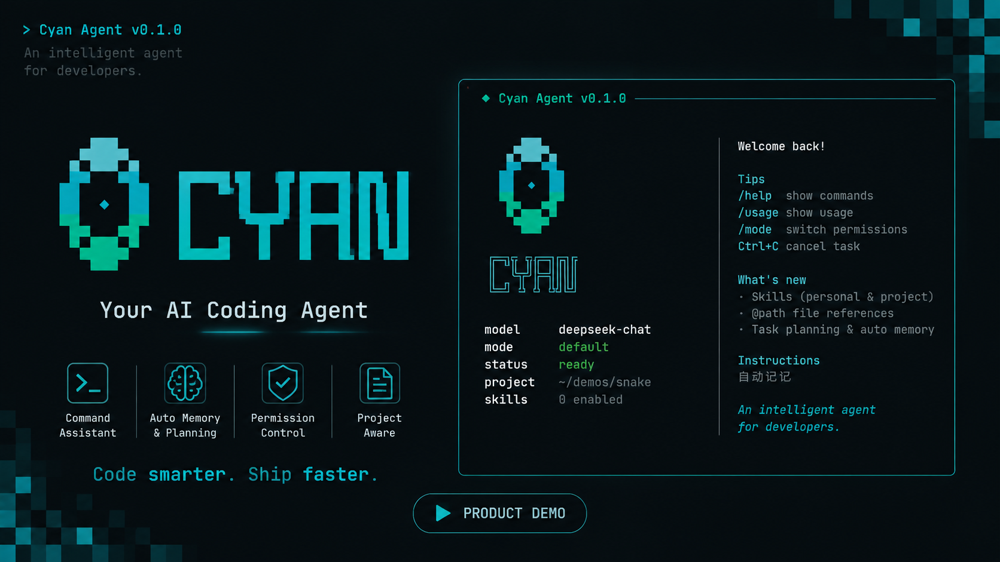

# Cyan

一个命令行编程智能体：接到自然语言任务后，自主读取目录、读写文件、执行命令，直到任务完成。



不依赖任何 Agent 框架或 SDK（LangChain / LlamaIndex / OpenAI Agents SDK / Claude Agent SDK 等一概未用），也不使用 Code Interpreter、Files API 等服务端托管工具。Agent Loop、工具系统、任务规划、上下文管理、Memory、模型输出解析、安全策略、终止条件与错误恢复全部自行实现，仅使用模型厂商的 OpenAI 兼容 API 与原生 Tool Calling。

仓库：https://github.com/cty8888/Cyan

## 快速开始

环境：Python 3.10+、[uv](https://docs.astral.sh/uv/)、DeepSeek API Key。内容搜索工具 `grep` 依赖本机 [ripgrep](https://github.com/BurntSushi/ripgrep)。

```bash
uv sync
echo "DEEPSEEK_API_KEY=sk-..." > .env
uv run cyan
```

常用参数：

| 参数 | 说明 |
| --- | --- |
| `-w, --workspace` | 工作目录，默认当前目录；Agent 只能访问该目录内的文件 |
| `-m, --model` | 模型名称，默认 `deepseek-chat`（也可用 `DEEPSEEK_MODEL`） |
| `--mode` | 权限模式：`plan` / `default` / `accept_edits`，默认 `default` |
| `-c, --continue` | 恢复本工作区最近一次会话，成功后先回放历史对话 |
| `--resume [id]` | 列出或指定会话 id 恢复，同样会回放 |
| `--max-iterations` | 单任务最大轮次，默认 30 |
| `--verbose` | 额外把日志打到 stderr（默认只写文件，不干扰界面） |
| `--no-stream` | 关闭流式输出（也可用 `CYAN_STREAM=0`） |

密钥也可写在工作区 `.env`；使用 `-w` 时会优先读该目录下的 `.env`。`CYAN_HOME` 可覆盖会话存储根（默认 `~/.cyan`）。

终端用 rich 渲染 Markdown、diff 与审批面板；助手回复默认按 SSE 流式显示。运行日志在工作区 `.cyan/logs/agent.log`。会话事件日志在 `~/.cyan/projects/<路径编码>/<session-id>.jsonl`，sidecar 为同目录下的 `<id>/meta.json`。

## 交互

敲 `/` 后不用按 Tab，随打字弹出斜杠命令候选；敲 `@` 同样弹出工作区内文件路径。历史记录保存在 `<home>/history`，跨会话保留。等待模型首个响应片段时显示转圈动画，开始流式输出后消失。任务执行中 Ctrl-C 中断。

`@path` 不是简单的文本替换：提交时会读出引用时刻的文件内容，打包成 `FileBlock` 快照，随本轮用户消息持久化、重放、参与压缩。不存在、逃出工作区、或像邮箱地址那样的 `@`，原样当自然语言处理。

常用斜杠命令：`/help`、`/mode`、`/permissions`、`/tools`、`/status`、`/model`、`/stream`、`/compact`、`/loop`、`/context`、`/skills`、`/skill`、`/memory`、`/todos`、`/changes`、`/history`、`/rewind`、`/sessions`、`/resume`、`/new`、`/exit`。`/compact`、`/loop`、`/tools`、`/context` 改的是本会话策略副本，不影响下次启动的默认值。完整用法见 [docs/commands.md](docs/commands.md)。

## 指令层（cyan.md）

开发者维护的持久化规则，组窗时作为独立 Prompt Layer 叠进 system，**不写入会话日志**。从宽到窄：

| 位置 | 作用 |
| --- | --- |
| `~/.cyan/cyan.md` | 个人偏好（所有项目）；`CYAN_HOME` 可覆盖根目录 |
| `{workspace}/.cyan/cyan.md` | 本仓库的团队规范，可提交进 git |
| `{workspace}/cyan.md` | 仅当 `.cyan/cyan.md` 不存在时的过渡位置 |

缺文件则跳过。改完下一轮模型调用即生效。`/instructions` 查看当前加载了哪些层。

## Skills

跟 cyan.md 同一套磁盘发现 + 组窗叠层，但支持多个、各自独立触发。**自动叠层启动时默认关闭**：会话里 `/skills on` 打开全部，或 `/skills enable <name>` 只启用某一个，立刻生效。环境变量 `CYAN_ENABLE_SKILLS=1` 只改启动默认值。一个 skill 是一个目录 + 一份 `SKILL.md`：

```
---
name: debugging-methodology
description: 遇到报错、测试失败、运行结果跟预期不一致时使用
---

<正文：给模型看的详细步骤/checklist>
```

| 位置 | 作用 |
| --- | --- |
| `~/.cyan/skills/<name>/SKILL.md` | 个人级，跨项目复用 |
| `{workspace}/.cyan/skills/<name>/SKILL.md` | 项目级，可提交进 git；同名覆盖个人级 |

正文整篇叠进 Prompt Layer（个人级 skill 在工作区沙箱外，现有工具读不到，所以不走「先摘要、再 read_file」）。`/skill <name>` 只对下一条任务强调一次。`/skills disable <name>` 把开关写入同层级的 `skills.json`，不影响 `SKILL.md` 本身。

## 自动记忆

项目级笔记写在 `{workspace}/.cyan/memory/`（git 忽略，不共享）：

| 文件 | 作用 |
| --- | --- |
| `MEMORY.md` | 索引，每条一行，组窗时加载 |
| `user.md` | 协作者偏好、角色（按需 `memory_read`） |
| `feedback.md` | 纠错、被确认的做法 |
| `project.md` | 代码 / git 看不出的进度与决策 |
| `reference.md` | 仓库外入口 |

任务中可用 `memory_write` 即时写入；仅任务**成功结束**后会再提取一次。中断或失败不沉淀。`CYAN_DISABLE_AUTO_MEMORY=1` 可关闭。cyan.md 是人写的规则，memory 是 Agent 写的笔记。

## 任务规划

多步骤任务由模型自己调用 `todo_write` 维护清单：每次传入**完整**列表（覆盖式，不是增量 patch），同一时刻最多一项 `in_progress`。清单随 checkpoint 与 `meta.json` 持久化，`/rewind` 回溯时恢复到当时状态。不改文件系统，任何权限模式下都免审批。用户用 `/todos` 查看，`/todos clear` 清空。

## 工具

| 工具 | 类型 | 说明 |
| --- | --- | --- |
| `list_dir` | 只读 | 树形列出目录，自动跳过 `.git`、`node_modules` 等 |
| `read_file` | 只读 | 带行号读取，支持 offset/limit 分段 |
| `glob` | 只读 | 按文件名 glob 查找，支持 `**` 与一层花括号，按 mtime 最多 100 条 |
| `grep` | 只读 | 基于 ripgrep 搜内容；默认只返回路径，遵守 `.gitignore` |
| `memory_list` | 只读 | 列出 `.cyan/memory/` 中的记忆文件 |
| `memory_read` | 只读 | 读取某一个记忆 md |
| `memory_write` | 写入 | 写入四类笔记之一并更新索引；非 Plan 下免审批 |
| `write_file` | 写入 | 整文件写入，自动创建父目录 |
| `edit_file` | 写入 | 精确字符串替换，要求匹配唯一 |
| `todo_write` | 写入 | 整体覆盖式更新任务规划清单；不改文件系统，任何模式下免审批 |
| `bash` | 执行 | 唯一的 shell 执行入口：测试、构建、git、脚本都走它 |

`bash` 每次调用都是独立新进程，不保留环境变量或别名；工作目录会在调用之间延续，越出工作区会被拉回根目录。文件类工具的路径一律相对项目根，不跟 bash 的 `cd` 走。system prompt 会给出本机 Python 解释器的绝对路径，避免模型写出环境中并不存在的 `python`。

## 安全模型

判定顺序：工作区沙箱 → `deny` → 关键删除询问 → `ask` → 只读 bash / allow → 三种模式与会话白名单。

1. **工作区沙箱**：路径必须落在工作区内。关键 `rm` / `rmdir`（`/`、顶级目录、家目录、工作区或其父目录，含 `$VAR/*` 与命令替换）不当成区外拒绝，改为强制询问：`allow` 不能预先批准，但可以点 `y`。
2. **声明式规则**（`allow` / `ask` / `deny`）：内置 [`defaults.json`](src/cyan/security/defaults.json) + `~/.cyan/settings.json` + 项目 `.cyan/settings.json` + `.cyan/settings.local.json`。写法：`Bash(pytest *)` / `Read(.env)` / `Edit(src/**)`。deny 压过 allow；`ask` 强制确认，没有「始终允许」。`sudo` 是内置 deny；`.env`、私钥、写 `.git` / `.vscode` / `.cyan` 是内置 ask。
3. **模式**：规则没覆盖时，只读 bash 所有模式免审批；Plan 拒写、AcceptEdits 放行普通写以及工作区内文件系统命令（受保护路径仍要确认）、Default 写入与非只读执行需确认。`y` 本次 / `n` 拒绝 / `a` 始终允许（写文件只活会话；bash 按子命令写入 local，最多 5 条）。

`/permissions` 列出规则；`allow|ask|deny` 写入 local；`remove` 可删 local / 项目 / 用户，不能删内置。写操作在确认前会展示完整 diff。

## 架构

分层解耦，CLI 与内核只通过事件流通信，内核不做任何输入输出：

```
cli/        REPL 与 rich 渲染，消费事件流、处理审批交互
core/       Agent Loop（Runtime + AgentLoop）、事件定义、identity system prompt
session/    会话状态、工具执行历史、工作区视图、压缩与分叉
context/    把消息历史与工具结果装配成发给模型的格式（叠 Prompt Layer）
prompt/     Prompt Layer：identity + cyan.md + Skills + MEMORY.md 索引
memory/     项目级 Auto Memory 存储与任务结束提取
llm/        模型客户端抽象与 DeepSeek 实现、输出解析
tools/      工具契约、注册表、文件系统与 bash 执行工具
security/   路径沙箱、硬地板、声明式规则、权限管理与审批协议
settings/   按域拆分的运行时设置（CLI 参数 > 环境变量 > 默认值）
```

Agent Loop 是 generator：向外 yield 事件，通过 `send()` 接收审批决策。工具的可预期失败不会中断循环，而是转成结构化结果回喂模型。终止条件：无工具调用的完整回复、轮次上限、连续工具失败、重复无效调用、用户中断。

完整设计见 [docs/architecture.md](docs/architecture.md)。

## 扩展

新增工具：继承 `Tool`，填 `name` / `description` / `capability` / `parameters`，实现 `run()`，然后在 `tools/registry.py` 的 `build_default_registry()` 里注册一行。JSON Schema 会自动导出给模型。

## 开发

```bash
uv sync --group dev
uv run pytest
```

推送到 `main` 或开 pull request 时，GitHub Actions 按 `uv.lock` 安装依赖，依次跑 `ruff check`（未用 import/变量）、`vulture`（未被引用的函数/常量）和同一套 pytest。本地可单独跑：

```bash
uv run ruff check src/ tests/
uv run vulture src/ tests/ --min-confidence 60
```


