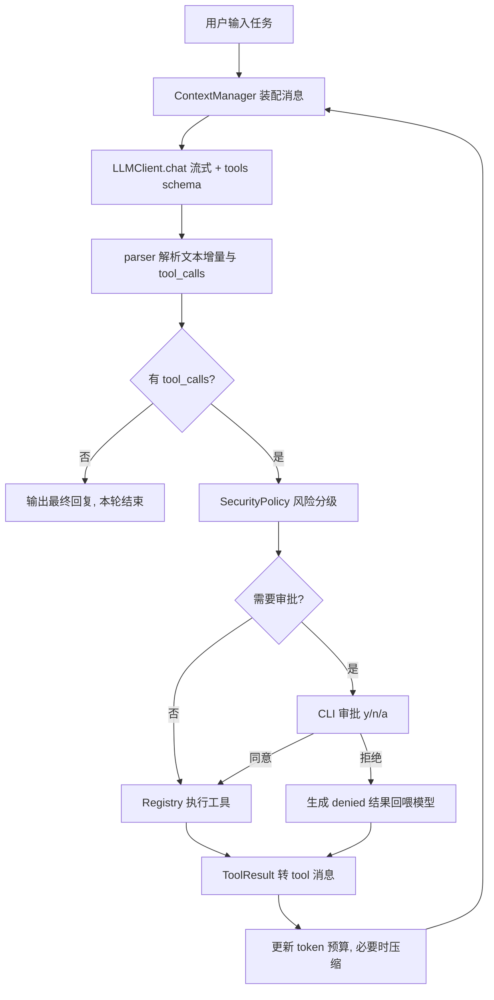

# Coding Agent 架构设计与开发规划

## 1. 设计原则

- 分层解耦：`CLI` 只负责交互与渲染，`core` 只负责 Agent 逻辑，二者通过**事件流**通信，未来换 TUI/Web 不动内核。
- 依赖倒置：`llm`、`tools`、`context`、`security` 全部先定义抽象接口，MVP 给最简实现，后续换实现不改 Agent Loop。
- 工具即插件：新增工具 = 新增一个类 + 一行注册，JSON Schema 由类自动导出。
- 错误不上抛：工具的可预期失败（文件不存在、命令超时、参数非法）统一转成结构化 `ToolResult` 回喂模型，由模型自主恢复；只有不可恢复错误才中断循环。

## 2. 目录结构

```
src/coding_agent/
  __main__.py            # 入口，参数解析
  config.py              # 配置（env + CLI flag + 默认值三级覆盖）
  errors.py              # 异常体系
  cli/
    app.py               # REPL 主循环、斜杠命令、Ctrl-C 中断
    renderer.py          # rich 渲染：流式文本、工具卡片、diff、审批提示
  core/
    agent.py             # Agent Loop（核心）
    session.py           # 会话状态：消息历史、已授权工具、轮次统计
    events.py            # AgentEvent：TextDelta / ToolStart / ToolEnd / NeedApproval / Done / Error
  llm/
    types.py             # Message / ToolCall / LLMResponse 内部数据结构
    base.py              # LLMClient 抽象
    deepseek.py          # OpenAI 兼容实现（DeepSeek）
    parser.py            # 模型输出解析：流式 tool_call 分片拼接、参数 JSON 容错
  tools/
    base.py              # Tool 抽象基类 + ToolResult + 参数校验
    registry.py          # 注册表：schema 导出 + 名称分发 + 执行封装
    filesystem.py        # list_dir / read_file / write_file / edit_file
    execution.py         # run_command / run_code
    runners/             # 语言执行器注册表，MVP 只注册 python
  security/
    policy.py            # 路径沙箱、命令黑名单、风险分级
    approval.py          # 审批交互协议（y / n / a / --yolo）
  context/
    manager.py           # 上下文装配 + token 预算 + 压缩触发
    compactor.py         # 历史摘要压缩
    memory.py            # 项目记忆（AGENTS.md）+ 会话持久化
```

## 3. Agent Loop 与数据流



`agent.run(task)` 是一个 **generator**，`yield` 事件给 CLI，审批通过 `send()` 回传结果，从而让内核完全不依赖 `input()`。

**终止条件**（必须全部实现，缺一会死循环）：
- 模型返回无 `tool_calls` 的完整回复
- 达到 `max_iterations`（默认 30）
- 用户 Ctrl-C 中断
- 连续 N 次工具失败（默认 3）或检测到「同工具 + 同参数」重复调用
- token 预算耗尽且压缩后仍超限

## 4. 工具系统

统一契约（`tools/base.py`）：

```python
class Tool(ABC):
    name: str
    description: str
    params_schema: dict        # JSON Schema，直接喂给 tool calling
    risk: RiskLevel            # READ / WRITE / EXEC
    def execute(self, args: dict, ctx: ToolContext) -> ToolResult: ...
```

`ToolResult(ok, content, error, metadata)`，`content` 是给模型看的纯文本，`metadata` 给 CLI 渲染用（如 diff）。

MVP 工具集：
- `list_dir`：目录树，支持 depth，自动跳过 `.git`/`node_modules`/`.venv`
- `read_file`：带行号返回，支持 offset/limit，大文件截断并提示
- `write_file`：整文件写入/新建
- `edit_file`：精确字符串替换（old_string 必须唯一，否则报错让模型补上下文）—— 比整文件重写省 token，是 Claude Code 的关键设计
- `run_command`：受控 shell，超时 + 输出截断 + 工作目录锁定
- `run_code`：**通过 `runners/` 语言注册表分发**，MVP 只注册 `python`（`sys.executable` 执行），扩展新语言只需注册一个 Runner，满足「初期只支持 Python 但易扩展」

## 5. 安全模型（分级审批）

- 路径沙箱：所有路径 `Path.resolve()` 后校验必须位于 workspace root 内，阻断 `..` 与符号链接逃逸
- 风险分级：`READ` 自动执行；`WRITE`/`EXEC` 需审批
- 审批选项：`y` 本次允许 / `n` 拒绝并让模型换方案 / `a` 本会话内该工具始终允许；`--yolo` 全局跳过
- 命令黑名单：`rm -rf /`、`mkfs`、`dd`、`shutdown`、`curl | sh` 等正则拦截，**不可用 `a` 或 `--yolo` 绕过**
- 敏感文件（`.env`、`.git/`）写入强制二次确认
- 写操作前生成 diff 预览，随审批提示一起展示

## 6. 上下文管理与 Memory

- Token 记账：以 API 返回的 `usage.prompt_tokens` 为准，本地启发式估算做预判
- 超过阈值（如 70% 上下文窗口）触发压缩：保留 system prompt + 最近 K 轮原始消息，中间历史用一次额外 LLM 调用摘要成「已完成事项 / 关键文件 / 待办」结构化文本
- 工具结果单条过长时先做局部截断，再考虑全局压缩
- Memory 两层：项目级 `AGENTS.md`（启动时注入 system prompt）+ 会话级持久化到 `.coding_agent/sessions/*.json`，支持 `--continue` 恢复

## 7. 开发排期

MVP（Phase 1）交付后即可端到端跑通「用户任务 → 分析 → 调工具 → 完成」，Phase 2-5 在不改内核接口的前提下增量补齐。

- Phase 1（MVP 闭环）：配置 + LLM 客户端（非流式）+ Tool 基类/注册表 + 6 个工具 + 安全策略 + Agent Loop + 基础 CLI
- Phase 2：流式输出 + rich 富渲染 + diff 预览 + Ctrl-C 中断
- Phase 3：上下文压缩 + Memory 持久化
- Phase 4：任务规划工具 `todo_write` + `grep`/`glob` 搜索工具
- Phase 5：pytest 单测 + README + 打磨

## 8. 依赖

现有 `openai` / `python-dotenv` / `rich` 已足够，Phase 5 追加 `pytest`。无需引入任何 Agent 框架。