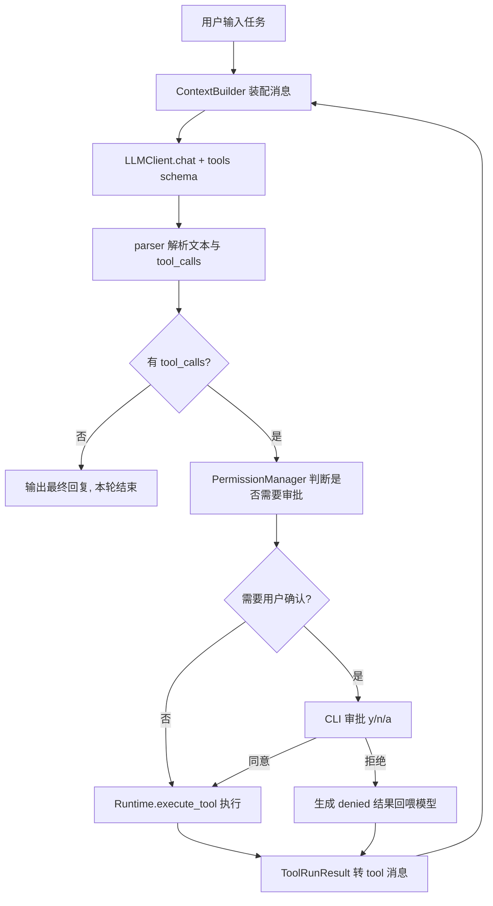

# Cyan 架构设计与开发规划

从零设计一个不依赖任何 Agent 框架的 CLI 编程智能体：分层模块化架构（LLM 层 / 工具层 / 安全层 / 上下文层 / Agent Loop / CLI 层）。先交付最小可用闭环，架构接口一次性按完整版切好，后续分阶段填充流式渲染、上下文压缩、Memory 与任务规划。

## 1. 设计原则

- 分层解耦：`CLI` 只负责交互与渲染，`core` 只负责 Agent 逻辑，二者通过**事件流**通信，未来换 TUI/Web 不动内核。
- 依赖倒置：`llm`、`tools`、`context`、`security` 全部先定义抽象接口，MVP 给最简实现，后续换实现不改 Agent Loop。
- 工具即插件：新增工具 = 新增一个类 + 一行注册，JSON Schema 由类自动导出。
- 错误不上抛：工具的可预期失败（文件不存在、命令超时、参数非法）统一转成结构化 `ToolResult` 回喂模型，由模型自主恢复；只有不可恢复错误才中断循环。

## 2. 目录结构

```
src/cyan/
  __main__.py            # 入口，参数解析
  errors.py              # 异常体系
  logutil.py             # logging 配置（默认只写文件，不抢 rich 界面）
  settings/              # 按职责拆开的运行时设置（CLI 参数 > 环境变量 > 默认值）
    agent.py             # AgentSettings：一次运行的入口（workspace + 各域）
    loader.py            # load_settings()
    llm.py               # LLMSettings：模型、地址、超时与重试
    loop.py              # LoopLimits：轮次 / 失败 / 重复上限
    tools.py             # ToolLimits：输出与读取截断
    cli.py               # CliSettings：日志、权限模式、状态目录
    compact.py           # CompactPolicy：阈值、预留、保留轮数（启动默认值）
  cli/
    app.py               # REPL 主循环、斜杠命令分发
    commands.py          # CommandRegistry：可扩展的斜杠命令
    renderer.py          # rich 渲染与界面文案（模式标签、终止原因、审批面板）
  core/
    types.py             # AgentEvent / StopReason / AgentStream
    runtime.py           # Runtime 组装 LLM / 工具 / 权限 / 上下文
    loop.py              # AgentLoop 驱动任务循环
    tool_executor.py     # ToolExecutor：实际执行工具（预留 hook 点）
    prompts.py           # identity system prompt 与 compact 摘要提示
  prompt/                # Prompt Layer（组窗时叠进 system，不进 Session）
    types.py             # PromptLayerKind / PromptLayer
    files.py             # 发现并读取 ~/.cyan/cyan.md 与 {workspace}/.cyan/cyan.md
    stack.py             # PromptStack：顺序、按层截断、render_system()
  memory/                # 项目级 Auto Memory（.cyan/memory/）
    types.py             # MemoryKind / MEMORY.md 上限
    settings.py          # CYAN_DISABLE_AUTO_MEMORY
    store.py             # 合法文件名、读写索引
    extract.py           # COMPLETED 后一次提取 chat
  session/               # Session 数据层（Loop 只通过 Runtime 读写）
    types.py             # 会话字段、工具执行历史
    session.py           # Session 门面
    compact.py           # 对话压缩（区间 → 额外 chat → compact overlay）
    events.py            # SessionEvent
    paths.py             # ~/.cyan 与路径编码
    store.py             # jsonl + sidecar + last
    view.py              # 事件表 → 组窗视图
    branch.py            # load / continue / fork
    workspace_access.py  # 工具能触达的受控工作区视图
  context/
    types.py             # ContextPolicy（装配期工具结果截断）
    builder.py           # ContextBuilder：装配 wire；第一条 system 叠 PromptStack
  llm/
    types.py             # Role / Block(...) / Message 继承体系 / LLMResponse
    base.py              # LLMClient 抽象
    deepseek.py          # OpenAI 兼容实现（DeepSeek）
    parser.py            # 模型输出解析：tool_call 参数 JSON 容错
  tools/
    types.py             # ToolCapability / ToolRunResult / ToolContext
    base.py              # Tool 抽象基类 + 参数校验
    registry.py          # 注册表：schema 导出 + 名称分发 + 执行封装
    diff.py              # write_file / edit_file 共用的 diff 生成
    process.py           # bash / grep 共用的子进程执行
    builtin/             # 每个内置工具一个文件：schema 常量 + 行为实现
      list_dir.py
      read_file.py
      write_file.py
      edit_file.py
      bash.py
      glob.py
      grep.py
      memory_list.py
      memory_read.py
      memory_write.py
  security/
    types.py             # PermissionMode / 审批协议 / PermissionOutcome
    permissions.py       # PermissionManager：判定链入口
    messages.py          # 回喂模型的权限文案（Plan 拒绝、用户拒绝等）
    paths.py             # 路径沙箱 + 写目标展示路径
    shell.py             # Plan 模式只读命令判定、执行头提取（白名单共用）
    command_paths.py     # 从 bash 命令抽出路径，套文件规则
    allowlist.py         # 本会话「始终允许」：write:{目录} / exec:{命令}
    floor.py             # 关键路径 rm/rmdir：强制询问，allow 不能预先批准
    rule_syntax.py       # Bash(pytest *) / Read(.env) / Edit(src/**)
    policy.py            # RuleSet：deny / ask / allow 判定
    settings_file.py     # 内置 + 用户 + 项目 + local JSON
    catalog.py           # 从 defaults.json 读命令名单 / 包装前缀 / 路径分析表
    defaults.json        # 内置 deny / ask + shell 名单
    rules.py             # 执行层二次拦截：转调 floor + 内置规则
    readonly.py          # 兼容旧导入，转调 shell.py
```

每个领域包对齐同一骨架：`types.py` 放 enum / dataclass；行为按职责单独成文件；共用函数用具体名字（`paths` / `diff` / `process` / `shell`），不设 `utils.py`。`settings/` 本身就是按域拆开的 dataclass，不再套一层 types；`cli/` 没有独立数据契约。

## 3. Agent Loop 与数据流



`runtime.run(task)` 是一个 **generator**，`yield` 事件给 CLI，审批通过 `send()` 回传结果，从而让内核完全不依赖 `input()`。

事件类型、与对话 Message 的双轨划分、以及和 Claude Code（异步 `query()` / 单向 message 流 / `can_use_tool` 回调）的对照，见 [docs/event-stream.md](event-stream.md)。**先不要改这套协议**——改形态会动 Loop / CLI / 测试里的 `drive()`，干扰对当前闭环的理解。

**终止条件**（必须全部实现，缺一会死循环）：

- 模型返回无 `tool_calls` 的完整回复
- 达到 `max_iterations`（默认 30）
- 用户 Ctrl-C 中断
- 连续 N 次工具失败（默认 3）或检测到「同工具 + 同参数」**连续**重复且中间无成功进展

token 预算触发压缩后任务继续，压缩失败不中断循环。

2026-08-30 对循环协议、重复检测、读文件已读标记的修复见 [docs/p0-fixes.md](p0-fixes.md)。

### Message 继承体系 + Block 内容模型 + ToolHistory 事实记录

三个互相独立、各司其职的结构：`Block` 承载「消息里的信息」，`Message` 只是「role + 一组 blocks」的容器，`ToolHistory` 承载「Agent 执行工具的事实记录」——三者不互相继承，`ToolHistory` 也不属于 `Message`。

```
Message (ABC dataclass：role: ClassVar[Role] + blocks: list[Block])
├── SystemMessage      # 只放一个 TextBlock
├── UserMessage        # TextBlock，未来可以混入 FileBlock / CodeBlock
├── SummaryMessage     # 压缩后的区间摘要；to_api 仍是 user
├── AssistantMessage   # TextBlock + 若干 ToolCallBlock，覆写 to_api() 处理 tool_calls
└── ToolMessage        # 只放一个 ToolResultBlock（只有 call id）

Block (ABC：type: ClassVar[BlockType])
├── TextBlock        # 文本
├── ToolCallBlock    # 一次工具调用（id / name / arguments）
├── ToolResultBlock  # 对一次工具调用结果的引用，只有 tool_call_id
├── FileBlock        # 文件引用（path / start_line / end_line），不携带文件内容
└── CodeBlock        # 独立代码片段（language / code）

session.tool_history（与 Message 完全解耦，挂在 Session 上，只负责保存与查询）
├── ToolResult      # content —— 工具输出原文
├── ToolExecution   # id / tool_name / arguments / status / result / started_at / finished_at / duration / error
└── ToolHistory     # dict[call_id, ToolExecution]，record() / get()

context.builder.ContextBuilder（装配层，由 Runtime 持有）
└── build_messages()  # 反查 ToolHistory；第一条 system 叠 PromptStack；工具正文按上限截尾
```

### Session 与 Runtime

```
Runtime（执行层，不保存长期状态）
 ├── LLMClient
 ├── ContextBuilder / ContextPolicy   # 装配 wire；叠 PromptStack
 ├── PromptStack                      # identity + cyan.md + MEMORY.md
 ├── CompactPolicy                    # 何时压、留几轮
 ├── ToolRegistry
 ├── ToolExecutor
 ├── PermissionManager
 └── Session（数据层）

Session
 ├── metadata      # id / created_at / updated_at / title
 ├── messages        # list[Message]
 ├── tool_history    # ToolHistory
 ├── state           # current_task / consecutive_tool_failures / last_call_fingerprint / consecutive_identical_calls
 ├── workspace       # root / cwd / opened_files / modified_files
 ├── permissions     # permission_mode / always_allowed（write:{目录} / exec:{命令名}）
 ├── usage           # input_tokens / output_tokens / total_tokens / llm_calls / tool_calls
 └── todos           # list[TodoItem]，todo_write 整体覆盖式维护，随 checkpoint / meta.json 持久化

ContextPolicy（装配，不属于 Session）
 └── max_tool_result_chars

CompactPolicy（压缩：默认值在 ``AgentSettings.compact``，App 拷一份注入 Runtime）
 └── max_context_tokens / reserve_tokens / trigger_ratio / keep_recent_turns
```

**运行时策略与斜杠命令**

配置分三类，不一律 `replace`：

- **启动身份**（workspace、api_key、log）：留在 `AgentSettings` / App，进程内基本不改；换模型不需要重建客户端（见下）。
- **会话状态**（`permission_mode`、`always_allowed`）：继续挂在 Session；`/mode` 是这个模式。
- **本会话行为策略**（compact / loop / tools / context）：默认值只住 `settings/`，`Runtime.create()` 用 `dataclasses.replace()` 各拷一份注入 `Runtime`（`compact_policy` / `loop_limits` / `tool_limits` / `context_policy`），`AgentLoop` 只读 Runtime 上的副本（`self.loop_limits`、`self.runtime.tool_limits`）。会话中途用斜杠命令改副本，不写回 `AgentSettings`。

四个策略域现在都收齐了：`/compact show|set`、`/loop`、`/tools limits|<字段> <值>`、`/context` 分别查看/修改对应副本；`cli/commands.py` 里的 `_show_policy` / `_set_policy_field` 是这四个命令共用的通用小工具，按 dataclass 字段的类型注解做字符串转换。

模型参数（`model` / `temperature`）留在 `LLMSettings`，不属于 Session；`DeepSeekClient.model` 是只读 property（实时读 `self._llm.model`，不在构造时缓存），所以 `/model <名字>` 改的是同一个 `LLMSettings` 对象，下一次调用立刻生效，不需要重建客户端，跟 `/stream` 是同一个模式。`/status` 一屏汇总模型、权限模式、流式开关、当前会话、上下文占用（`estimate_request_tokens() / compact_policy.max_context_tokens`）与调用统计。

核心原则：Session 保存 Agent 的「过去和当前状态」，Runtime 负责 Agent 的「下一步行动」。Session 是数据，Runtime 是行为。

关键约束：**`Message` 子类自己不额外开业务字段，也不直接持有工具执行的真实内容**。`ToolMessage` 只知道「这条消息对应哪个 call id」（`ToolResultBlock.tool_call_id`），一次工具调用真正的输出内容、成功与否、执行耗时，属于 Agent 执行工具的事实记录，跟 Session 一起存在于 `tool_history` 里，不属于 Message。对话压缩（[`session/compact.py`](src/cyan/session/compact.py)）会把较早的消息区间额外 `chat` 一次收成 `SummaryMessage` 写回列表，并删除该区间对应的 `tool_history` 条目；失败则两者都不改。

`ToolHistory` 只提供 `record()` / `get()` / `remove()`，不承担展示职责。`ToolResult` 只保存 ``content``。发给模型时由 ``ContextBuilder`` 按 ``max_tool_result_chars`` 截尾，不写回 Session。

`Runtime.messages_for_request()` 委托给 `ContextBuilder.build_messages()`——它读取 Session 的 `messages` 和 `tool_history`，把 PromptStack 叠到第一条 system 的 **wire** 上（cyan.md 不写回 Session），并按上限截工具正文；`LLMClient.chat()` 因此直接接收装配好的 `list[dict]`，不需要认识 `Message` 这个内部类型。

## 4. 工具系统

统一契约（`tools/base.py`）：

```python
class Tool(ABC):
    name: str
    description: str
    capability: ToolCapability  # READ / WRITE / EXEC —— 决定模式怎么分流
    parameters: dict            # JSON Schema，直接喂给 tool calling
    def describe(self, args, workspace) -> tuple[str, str | None, str]: ...
    def run(self, ctx: ToolContext, **kwargs) -> ToolRunResult: ...
```

`ToolResult(ok, content, error, metadata)`，`content` 是给模型看的纯文本，`metadata` 给 CLI 渲染用（如 diff）。

MVP 工具集：

- `list_dir`：目录树，支持 depth，自动跳过 `.git`/`node_modules`/`.venv`
- `read_file`：带行号返回，支持 offset/limit，大文件截断并提示
- `write_file`：整文件写入/新建
- `edit_file`：精确字符串替换（old_string 必须唯一，否则报错让模型补上下文）—— 比整文件重写省 token，是 Claude Code 的关键设计
- `glob`：按文件名模式找文件（Python 实现，支持 `**` 与一层花括号），按 mtime 新→旧最多 100 条；不尊重 `.gitignore`，跳过 `.git/`
- `grep`：子进程调用 `rg` 搜内容；`files_with_matches` / `content` / `count` 三种输出；遵守 `.gitignore`，显式 `path` 可搜被 ignore 的文件
- `bash`：唯一的 shell 执行入口，测试、构建、git、脚本都走它。学习 Claude Code 的 Bash 工具设计：
  - 接口只有 `command`（必填）与 `timeout_ms`（默认 120000）
  - 每条命令都在独立新进程里跑，没有持久 shell；不保留环境变量或别名，`export` 不影响下一次调用
  - 工作目录会在调用之间延续：给命令追加一段 trailer 脚本，执行结束后打印 `$PWD`，
    解析出来后写回会话状态（`Session.bash_cwd`），下一次调用从那里继续；越出工作目录会被拉回工作目录根
  - stdout/stderr 合并成一路输出，超过 `max_tool_output_chars`（默认 30000）时截掉超出的尾部、保留开头，并加 `...[truncated]`
  - system prompt 里写明本机 `sys.executable` 的绝对路径，避免模型在命令里假设存在 `python` 这个命令（很多环境只有 `python3`）
  - 先不做：后台任务、shell 别名加载、环境变量持久化、输出落盘、权限沙箱——等基础跑稳再加

## 5. 安全模型

`ToolCapability` + 声明式规则，由 [`PermissionManager.evaluate()`](src/cyan/security/permissions.py) 一次判定。

**能力**（写在每个 `Tool` 上）：`READ` / `WRITE` / `EXEC`。Plan 拒写；AcceptEdits 放行普通写（执行仍要确认）。

**判定顺序**：工作区沙箱 → deny 规则 → 关键删除强制询问 → ask 规则 → 只读 bash / allow 规则 → 三种模式与会话白名单。deny 压过 allow。关键删除的落点不走「区外拒绝」，以便用户能当场确认。Plan 在 allow 之前：`Edit(src/**)` 不能覆盖 Plan 拒写。`deny Read(.env)` 连带挡住同一路径的写入与 bash 读。

**关键删除**（[`floor.py`](src/cyan/security/floor.py)）：`rm` / `rmdir` 打到 `/`、`/usr` 等根下顶级目录、家目录、`.`、工作区或其父目录；`$VAR/*` / `$VAR/`；命令替换里的同样形状。`permissions.allow` 不能预先批准，用户可以当场确认。

**规则**（[`defaults.json`](src/cyan/security/defaults.json) + 用户/项目/local JSON）。只读命令、包装前缀、安全环境变量、acceptEdits 文件系统命令写在同一文件的 `shell` 段，用户设置不能覆盖。

| 种类 | 处置 | 内置例子 |
|------|------|----------|
| **deny** | 永远 DENY | `Bash(sudo *)`、`Bash(git push --force *)` |
| **ask** | NEED_APPROVAL + `force=True`，没有「始终允许」 | `.env`、私钥、`pip install`、`git push`、写 `.git` / `.vscode` / `.cyan` / shell rc |
| **allow** | 放行（deny 与关键删除仍优先） | `Bash(pytest *)`、`Edit(src/**)` |

写法：`Bash(pytest *)` / `Read(.env)` / `Edit(src/**)` / `WebFetch(domain:host)`。`Tool(param:value)` 匹配顶级标量参数（deny/ask）；`Bash(command:…)` / `Read(path:…)` / `WebFetch(url:…)` 会忽略并警告。`Write` 裸名匹配写入工具；`Write(路径)` 收下但不做路径检查。未知工具名按工具名匹配，以后加网络工具不必改解析器。路径还可写成 `/src/**`（相对设置源：用户设置锚到 `~/.cyan`，项目/local 锚到工作区）、`~/Documents/*.pdf`、`//tmp/scratch.txt`。复合命令先切段（`&&` `||` `;` `|` `|&` `&` 换行）：deny/ask 任一段命中即生效；allow 必须每段都命中。点 `a` 对复合命令按子命令各存一条 allow，最多 5 条。设置文件：内置 defaults + `~/.cyan/settings.json` + `{workspace}/.cyan/settings.json` + `settings.local.json`。`/permissions` 列出、增（写 local）、删（local / 项目 / 用户，不能删内置）。

**PermissionMode**（规则没覆盖时）：

| 模式 | 只读 | 普通写入 | 普通执行 |
|------|------|----------|----------|
| Plan | 放行 | DENY | 仅放行只读命令（`git status`、`pytest`、`ls` 等，名单在 `defaults.json` 的 `shell`） |
| Default | 放行 | 需审批 | 只读命令免审批，其余需审批 |
| AcceptEdits | 放行 | 直接放行（`.vscode` / `.cyan` / shell rc 等内置 ask 仍要确认） | 工作区内 `mkdir`/`touch`/`mv`/`cp`/`rm`/`sed` 免审批，其余需审批 |

审批选项：`y` 本次允许 / `n` 拒绝 / `a` 本会话始终允许同类操作（仅非 force）。写入按目录前缀（根目录文件记 `write:.`，只放行根下其它文件；`write:pkg` 放行 `pkg/` 及其子目录，`write_file` 与 `edit_file` 共用），执行按**每一段**的命令头（`exec:pytest` 只放行 `pytest …`，不放行 `touch`；`git status && git commit` 要两段都在白名单里）。bash 点 `a` 还会往 local 按子命令追加 `Bash(pytest *)`，最多 5 条。用户拒绝后回喂模型换方案。路径沙箱（`security/paths.py`）独立于规则：文件工具走 `resolve_path`；bash 由 `command_paths.py` 抽出能看清的路径（重定向、`cat`/`echo`/`cd`、`env -C` / `git -C`、`git show HEAD:.env` 等）再套同一套沙箱 / write deny / ask。先剥 `env` / `timeout` 等包装再判定。`python -c`、命令替换等解析不到的标成不透明，路径层不当成已看清，但 `allow` 仍可放行。执行头按 `git status` 而不是整条 `git` 记白名单。路径只按 Linux 语义处理。

组件职责：

1. **`floor.py`**：关键路径删除（强制询问）
2. **`rule_syntax.py` / `policy.py` / `settings_file.py`**：规则解析、合并、判定
3. **`shell.py` / `catalog.py`**：只读判定与执行头提取；名单在 `defaults.json` 的 `shell`
4. **`command_paths.py`**：从 bash 命令抽出路径，套文件沙箱 / write deny / ask
5. **`allowlist.py`**：本会话始终允许的范围键
6. **`PermissionManager`**：编排判定链，产出 `PermissionOutcome`
7. **工具 `run()`**：对内置 write deny / 区外路径再拦一次

## 6. 上下文管理与 Memory

- Token 记账：压缩触发看「即将发出的整包」——组窗后的 wire 用 JSON 字符数 / 4 粗估；上一轮 API 的 `usage.prompt_tokens`（`last_prompt_tokens`）只作补充，那次已经超阈值则这轮出门前先压。默认窗口按 deepseek-chat 常见 64k 计。优先保留 `keep_recent_turns` 轮；不够切或仍超窗时降到 1 轮乃至全部压进摘要。API 报超窗则紧急压缩后重试一次。
- 压缩成功后往事件表追加 `summary` + `compact`，再投影成视图；**不删除** jsonl 里的原文与 `tool_history` 事实。组窗仍只看 Session.messages + 视图内的 tool_history。REPL `/compact` 走同一入口。详见 [session-store.md](session-store.md)。
- 不做滑动窗口：对话变瘦只靠 compact overlay。
- 会话持久化：`~/.cyan/projects/<编码>/<id>.jsonl`；`--continue` / `--resume`；rewind 为 fork。
- **Prompt Layer**：identity（`build_system_prompt`）写入 `session_started`；用户级 `~/.cyan/cyan.md` 与项目级 `{workspace}/.cyan/cyan.md`（没有则回退根目录 `cyan.md`）是独立层。`MEMORY.md` 索引作为 `AUTO_MEMORY` 层叠进 wire，类型文件按需 `memory_read`。cyan.md / memory **不进 jsonl**。`/instructions` 看层，`/memory` 看记忆文件。
- **Auto Memory**：只做项目级，目录 `{workspace}/.cyan/memory/`（gitignore）。任务中 `memory_write` 即时写（非 Plan 免审批）；`COMPLETED` 后再提取一次。`USER_ABORT` / `FATAL_ERROR` / 轮次上限 / 连续失败不沉淀。`CYAN_DISABLE_AUTO_MEMORY=1` 关闭。
- **任务规划（`todo_write`）**：对齐 Claude Code 的 TodoWrite——模型自己判断何时用（3 步以上/多文件），每次调用传入**完整**清单（覆盖式更新，不是增量 patch），同一时刻最多一项 `in_progress`。数据模型是 `Session.todos: list[TodoItem]`（`content` / `status: TodoStatus` / `active_form`），随 `checkpoint` 事件与 sidecar `meta.json` 走，不单独进事件表；`/rewind` 回溯时随 checkpoint 一起恢复到当时的清单状态。工具侧不直接拿 `Session`：`ToolContext.todos` 是 `TodoAccess`（跟 `WorkspaceAccess` 同构的最小包装，只转发 `items`/`set()`），在 `core/loop.py` 的 `tool_ctx` 里注入。权限上跟 `memory_write` 同构——`_family_for_tool` 对它返回 `None`（没有路径参数，走不了按路径匹配的 family 规则），`PermissionManager.evaluate()` 里特判成始终 `allow`（比 `memory_write` 更宽：不受 Plan 模式限制，因为规划本身就是 Plan 模式该干的事），`BARE_DENY_TOOLS["write"]` 仍收着它，用户配置裸 `deny: write` 时会把它从模型可见工具列表里摘掉（`hidden_tool_names()`）。CLI 侧 `tool_finished` 对 `todo_write` 特判，把 `ToolRunResult.metadata["todos"]` 渲成打勾清单（`cli/renderer.py` 的 `render_todo_lines()`），`/todos` 命令复用同一个渲染函数查看当前清单，`/todos clear` 手动清空。

## 7. 开发排期

MVP（Phase 1）交付后即可端到端跑通「用户任务 → 分析 → 调工具 → 完成」，Phase 2-5 在不改内核接口的前提下增量补齐。

### Phase 1：MVP 闭环（已完成）

- [x] 搭建目录骨架、`settings/`（按域拆分的三级覆盖）、`errors.py` 异常体系
- [x] llm 层：types/base 抽象 + deepseek OpenAI 兼容实现（非流式）+ parser 的 tool_call 参数 JSON 容错解析
- [x] tools 层：Tool 基类 + ToolRunResult + registry 自动导出 schema，实现 `list_dir`/`read_file`/`write_file`/`edit_file`/`bash`/`glob`/`grep`
- [x] execution 工具：`bash`（超时/输出截断/跨调用工作目录延续），对齐 Claude Code 的 Bash 工具设计，取代早期的 `run_command`+`run_code` 双工具方案
- [x] security 层：路径沙箱、硬地板、声明式 allow/ask/deny、权限管理与审批协议（y/n/a）、Plan 模式只读命令判定（`shell.py`）
- [x] `core/runtime` Agent Loop（generator + 事件流）、session 状态、全部终止条件与错误恢复策略
- [x] 基础 CLI REPL：消费事件流、处理审批交互，跑通端到端最小闭环
- [x] 提前补做：审批 diff 预览、Ctrl-C 中断、离线测试 `tests/`（pytest）
- [x] 标准库 logging：事件写入 `.cyan/logs/agent.log`（默认不打 stderr）

### Phase 2：交互体验

- [x] 流式输出（`stream=True` + tool_call 分片拼接；`LLMClient.chat_stream()` 默认退化成一次性 `chat()`，`DeepSeekClient` 覆写做真正的 SSE；`--no-stream` / `CYAN_STREAM` 可关闭）
- [x] tool_call 参数流式可视化（`ToolCallDelta` 事件携带 `index`/`call_id`/`name`/`arguments_delta`；CLI 侧对 `write_file`/`edit_file` 尽力从未解析完的 JSON 里抠出 `content`/`new_string` 字段边生成边展示，其它工具退化成原始 JSON 片段；真正执行仍等完整 JSON 拼好、解析通过后才发起）
- [x] rich 富渲染：工具卡片、diff 预览、执行输出摘要
- [x] Ctrl-C 中断（中断时补齐未响应的 tool_call，保证上下文完整）
- [x] 丰富斜杠命令：`loop`/`tools`/`context` 收成与 `compact` 相同的「settings 默认 → `Runtime.create()` 拷贝注入」模式；新增 `/loop`、`/context`、`/model`、`/status`，扩展 `/tools`（`limits` 子命令）、`/compact`（`show`/`set` 子命令）

### Phase 3：上下文与记忆

- [x] 上下文 token 预算与历史摘要压缩（compact overlay，事件表保留原文）
- [x] 会话持久化与 `--continue` / `--resume` / rewind fork
- [x] Prompt Layer：用户级 / 项目级 `cyan.md`（组窗叠层，不进 Session）
- [x] Auto Memory：项目级 `.cyan/memory/`（即时写入 + COMPLETED 提取）

### Phase 4：规划与检索

- [x] 任务规划工具 `todo_write`
- [x] `grep` / `glob` 搜索工具

### Phase 5：工程收尾

- [x] 把离线测试改写为按模块拆分的 pytest 用例
- [x] README
- [x] 最小 GitHub Actions：push / PR 跑 pytest
- [ ] 整体打磨

## 8. 依赖

现有 `openai` / `python-dotenv` / `rich` 已足够，开发依赖为 `pytest`。无需引入任何 Agent 框架。
