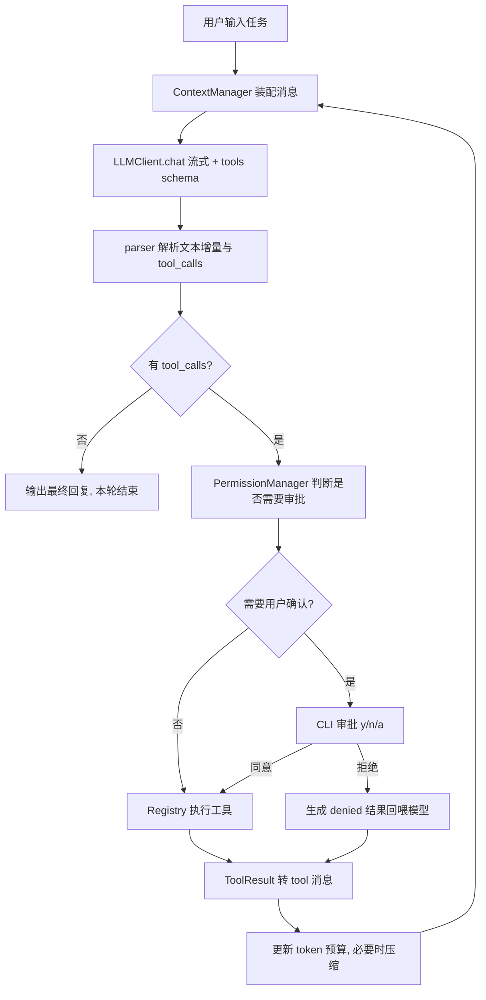

# Coding Agent 架构设计与开发规划

从零设计一个不依赖任何 Agent 框架的 CLI 编程智能体：分层模块化架构（LLM 层 / 工具层 / 安全层 / 上下文层 / Agent Loop / CLI 层）。先交付最小可用闭环，架构接口一次性按完整版切好，后续分阶段填充流式渲染、上下文压缩、Memory 与任务规划。

## 1. 设计原则

- 分层解耦：`CLI` 只负责交互与渲染，`core` 只负责 Agent 逻辑，二者通过**事件流**通信，未来换 TUI/Web 不动内核。
- 依赖倒置：`llm`、`tools`、`context`、`security` 全部先定义抽象接口，MVP 给最简实现，后续换实现不改 Agent Loop。
- 工具即插件：新增工具 = 新增一个类 + 一行注册，JSON Schema 由类自动导出。
- 错误不上抛：工具的可预期失败（文件不存在、命令超时、参数非法）统一转成结构化 `ToolResult` 回喂模型，由模型自主恢复；只有不可恢复错误才中断循环。

## 2. 目录结构

```
src/coding_agent/
  __main__.py            # 入口，参数解析
  config.py              # 配置（env + CLI flag + 默认值三级覆盖）
  errors.py              # 异常体系
  logutil.py             # logging 配置（默认只写文件，不抢 rich 界面）
  cli/
    app.py               # REPL 主循环、斜杠命令、Ctrl-C 中断
    renderer.py          # rich 渲染：Markdown、工具卡片、diff、审批提示
  core/
    agent.py             # Agent 入口，持有 Runtime 驱动 Loop
    runtime.py           # Runtime：组合 LLMClient / ContextBuilder / ToolExecutor / PermissionManager
    tool_executor.py     # ToolExecutor：实际执行工具
    session/             # Session 数据层（metadata / messages / tool_history / state / workspace / permissions / usage / config）
    tool_history.py      # ToolExecution / ToolHistory 事实记录
    events.py            # AgentEvent
  context/
    builder.py           # ContextBuilder：装配 wire 格式，决定工具结果展示策略
  llm/
    types.py             # Role / Block(...) / Message 继承体系(System/User/Assistant/Tool) / LLMResponse
    base.py              # LLMClient 抽象
    deepseek.py          # OpenAI 兼容实现（DeepSeek）
    parser.py            # 模型输出解析：流式 tool_call 分片拼接、参数 JSON 容错
  tools/
    base.py              # Tool 抽象基类 + ToolResult + 参数校验
    registry.py          # 注册表：schema 导出 + 名称分发 + 执行封装
    _diff.py             # write_file / edit_file 共用的 diff 生成
    _process.py          # bash 工具共用的子进程执行辅助
    list_dir.py
    read_file.py
    write_file.py
    edit_file.py
    bash.py
  security/
    policy.py            # 路径沙箱、blocked/restricted/sensitive 统一入口
    security_rules.py    # Blocked / Restricted / Sensitive 路径与命令规则
    modes.py             # ExecutionMode（ask / agent / yolo）
    permissions.py       # PermissionManager.evaluate() → PermissionOutcome
    approval.py          # 审批交互协议（y / n / a）
  context/
    manager.py           # 上下文装配 + token 预算 + 压缩触发
    compactor.py         # 历史摘要压缩
    memory.py            # 项目记忆（AGENTS.md）+ 会话持久化
```

## 3. Agent Loop 与数据流



`agent.run(task)` 是一个 **generator**，`yield` 事件给 CLI，审批通过 `send()` 回传结果，从而让内核完全不依赖 `input()`。

**终止条件**（必须全部实现，缺一会死循环）：

- 模型返回无 `tool_calls` 的完整回复
- 达到 `max_iterations`（默认 30）
- 用户 Ctrl-C 中断
- 连续 N 次工具失败（默认 3）或检测到「同工具 + 同参数」重复调用
- token 预算耗尽且压缩后仍超限

### Message 继承体系 + Block 内容模型 + ToolHistory 事实记录

三个互相独立、各司其职的结构：`Block` 承载「消息里的信息」，`Message` 只是「role + 一组 blocks」的容器，`ToolHistory` 承载「Agent 执行工具的事实记录」——三者不互相继承，`ToolHistory` 也不属于 `Message`。

```
Message (ABC dataclass：role: ClassVar[Role] + blocks: list[Block])
├── SystemMessage      # 只放一个 TextBlock
├── UserMessage        # TextBlock，未来可以混入 FileBlock / CodeBlock
├── AssistantMessage   # TextBlock + 若干 ToolCallBlock，覆写 to_api() 处理 tool_calls
└── ToolMessage        # 只放一个 ToolResultBlock（只有 call id）

Block (ABC：type: ClassVar[BlockType])
├── TextBlock        # 文本
├── ToolCallBlock    # 一次工具调用（id / name / arguments）
├── ToolResultBlock  # 对一次工具调用结果的引用，只有 tool_call_id
├── FileBlock        # 文件引用（path / start_line / end_line），不携带文件内容
└── CodeBlock        # 独立代码片段（language / code）

core.tool_history（与 Message 完全解耦，挂在 Session 上，只负责保存与查询）
├── ToolResult      # content / summary / ref —— 只存数据，提供 has_summary / content_removed / render()
├── ToolExecution   # id / tool_name / arguments / status / result / started_at / finished_at / duration / error
└── ToolHistory     # dict[call_id, ToolExecution]，record() / get()

context.builder.ContextBuilder（展示策略层，由 Runtime 持有）
└── build_messages()  # 反查 ToolHistory，按 render_mode 调用 result.render("summary"|"full")
```

### Session 与 Runtime

```
Runtime（执行层，不保存长期状态）
 ├── LLMClient
 ├── ContextBuilder
 ├── ToolExecutor
 ├── PermissionManager
 └── Session（数据层）

Session
 ├── metadata      # id / created_at / updated_at / title
 ├── messages        # list[Message]
 ├── tool_history    # ToolHistory
 ├── state           # current_task / plan / current_step / variables / ...
 ├── workspace       # root / cwd / opened_files / modified_files / environment
 ├── permissions     # always_allowed / denied / rules
 ├── usage           # input_tokens / output_tokens / total_tokens / llm_calls / tool_calls
 └── config          # model / max_context_tokens / tool_result_mode / temperature / system_prompt
```

核心原则：Session 保存 Agent 的「过去和当前状态」，Runtime 负责 Agent 的「下一步行动」。Session 是数据，Runtime 是行为。

关键约束：**`Message` 子类自己不额外开业务字段，也不直接持有工具执行的真实内容**。`ToolMessage` 只知道「这条消息对应哪个 call id」（`ToolResultBlock.tool_call_id`），一次工具调用真正的输出内容、成功与否、执行耗时，属于 Agent 执行工具的事实记录，跟 Session 一起长期存在于 `tool_history` 里，不属于 Message——这是为 Phase 3 的上下文压缩铺路：压缩由 `CompressionManager` 负责（生成 `summary`、保存原文、`ref`、删除 `content`），完全不用碰 `Message` 历史。

`ToolHistory` 只提供 `record()` / `get()` / `remove()`，不承担展示职责。`ToolResult` 只保存数据（`content` / `summary` / `ref`），提供 `has_summary`、`content_removed` 等基础状态视图，以及 `render(mode="summary"|"full")` 基础渲染——不参与压缩策略判断。`ContextBuilder.render_mode` 决定调用哪种渲染模式；调试或深入分析时可设为 `"full"`。

`Runtime.messages_for_request()` 委托给 `ContextBuilder.build_messages()`——它读取 Session 的 `messages` 和 `tool_history`，是唯一能把两者拼起来并决定展示策略的地方；`LLMClient.chat()` 因此直接接收装配好的 `list[dict]`，不需要认识 `Message` 这个内部类型。

## 4. 工具系统

统一契约（`tools/base.py`）：

```python
class Tool(ABC):
    name: str
    description: str
    params_schema: dict        # JSON Schema，直接喂给 tool calling
    risk: RiskLevel            # READ / WRITE / EXEC
    def execute(self, args: dict, ctx: ToolContext) -> ToolResult: ...
```

`ToolResult(ok, content, error, metadata)`，`content` 是给模型看的纯文本，`metadata` 给 CLI 渲染用（如 diff）。

MVP 工具集：

- `list_dir`：目录树，支持 depth，自动跳过 `.git`/`node_modules`/`.venv`
- `read_file`：带行号返回，支持 offset/limit，大文件截断并提示
- `write_file`：整文件写入/新建
- `edit_file`：精确字符串替换（old_string 必须唯一，否则报错让模型补上下文）—— 比整文件重写省 token，是 Claude Code 的关键设计
- `bash`：唯一的 shell 执行入口，测试、构建、git、脚本都走它。学习 Claude Code 的 Bash 工具设计：
  - 接口只有 `command`（必填）与 `timeout_ms`（默认 120000）
  - 每条命令都在独立新进程里跑，没有持久 shell；不保留环境变量或别名，`export` 不影响下一次调用
  - 工作目录会在调用之间延续：给命令追加一段 trailer 脚本，执行结束后打印 `$PWD`，
    解析出来后写回会话状态（`Session.bash_cwd`），下一次调用从那里继续；越出工作目录会被拉回工作目录根
  - stdout/stderr 合并成一路输出，超过 `max_tool_output_chars`（默认 30000）从尾部截断并加 `...[truncated]`
  - system prompt 里写明本机 `sys.executable` 的绝对路径，避免模型在命令里假设存在 `python` 这个命令（很多环境只有 `python3`）
  - 先不做：后台任务、shell 别名加载、环境变量持久化、输出落盘、权限沙箱——等基础跑稳再加

## 5. 安全模型

三层权限决策链：

1. **Layer 1 — Tool.risk**（工具固有能力）：READ / WRITE / EXEC
2. **Layer 2 — ExecutionMode**（执行模式）：Ask（只读）/ Agent（默认）/ YOLO（宽松）
3. **Layer 3 — PermissionManager**（单次判定）：ALLOW / DENY / NEED_APPROVAL

安全规则分级（[`security_rules.py`](src/coding_agent/security/security_rules.py)，write 与 exec 统一）：

| 级别 | 处置 |
|------|------|
| **Blocked 黑名单** | 永远 DENY（`sudo`、`rm -rf /` 等） |
| **Restricted 强硬限制** | Agent/YOLO 直接 DENY，不出审批 UI（`git push -f`、写 `.git/` 等） |
| **Sensitive 敏感** | NEED_APPROVAL + force（`.env`、`pip install` 等） |
| **Normal 普通** | 由执行模式决定 |

**Agent vs YOLO**（Normal 级别）：Agent 模式下普通 write 直接放行、普通 exec 需审批；YOLO 模式下普通 write/exec 均直接放行。Sensitive 两种模式均逐次确认，Restricted/Blocked 均直接拒绝。

审批选项：`y` 本次允许 / `n` 拒绝 / `a` 本会话始终允许该工具（仅非 force 操作）。用户拒绝后回喂模型换方案。

组件职责：

1. **SecurityPolicy**：路径沙箱 + `blocked/restricted/sensitive_concern(tool, args)` 统一入口
2. **PermissionManager**：结合 ExecutionMode 与白名单，产出 `PermissionOutcome`

## 6. 上下文管理与 Memory

- Token 记账：以 API 返回的 `usage.prompt_tokens` 为准，本地启发式估算做预判
- 超过阈值（如 70% 上下文窗口）触发压缩：保留 system prompt + 最近 K 轮原始消息，中间历史用一次额外 LLM 调用摘要成「已完成事项 / 关键文件 / 待办」结构化文本
- 工具结果单条过长时先做局部截断，再考虑全局压缩
- Memory 两层：项目级 `AGENTS.md`（启动时注入 system prompt）+ 会话级持久化到 `.coding_agent/sessions/*.json`，支持 `--continue` 恢复

## 7. 开发排期

MVP（Phase 1）交付后即可端到端跑通「用户任务 → 分析 → 调工具 → 完成」，Phase 2-5 在不改内核接口的前提下增量补齐。

### Phase 1：MVP 闭环（已完成）

- [x] 搭建目录骨架、`config.py`（三级配置覆盖）、`errors.py` 异常体系
- [x] llm 层：types/base 抽象 + deepseek OpenAI 兼容实现（非流式）+ parser 的 tool_call 参数 JSON 容错解析
- [x] tools 层：Tool 基类 + ToolResult + registry 自动导出 schema，实现 `list_dir`/`read_file`/`write_file`/`edit_file`
- [x] execution 工具：`bash`（超时/输出截断/跨调用工作目录延续），对齐 Claude Code 的 Bash 工具设计，取代早期的 `run_command`+`run_code` 双工具方案
- [x] security 层：路径沙箱、命令黑名单、权限管理与审批协议（y/n/a）
- [x] `core/agent.py` Agent Loop（generator + 事件流）、session 状态、全部终止条件与错误恢复策略
- [x] 基础 CLI REPL：消费事件流、处理审批交互，跑通端到端最小闭环
- [x] 提前补做：审批 diff 预览、Ctrl-C 中断、离线冒烟测试 `tests/smoke.py`
- [x] 标准库 logging：事件写入 `.coding_agent/logs/agent.log`（默认不打 stderr）

### Phase 2：交互体验

- [ ] 流式输出（`stream=True` + tool_call 分片拼接）
- [x] rich 富渲染：工具卡片、diff 预览、执行输出摘要
- [x] Ctrl-C 中断（中断时补齐未响应的 tool_call，保证上下文完整）

### Phase 3：上下文与记忆

- [ ] 上下文 token 预算与历史摘要压缩
- [ ] Memory：`AGENTS.md` 注入、会话持久化与 `--continue` 恢复

### Phase 4：规划与检索

- [ ] 任务规划工具 `todo_write`
- [ ] `grep` / `glob` 搜索工具

### Phase 5：工程收尾

- [ ] 把 `tests/smoke.py` 的 50 项检查改写为 pytest 用例
- [x] README
- [ ] 整体打磨

## 8. 依赖

现有 `openai` / `python-dotenv` / `rich` 已足够，Phase 5 追加 `pytest`。无需引入任何 Agent 框架。
