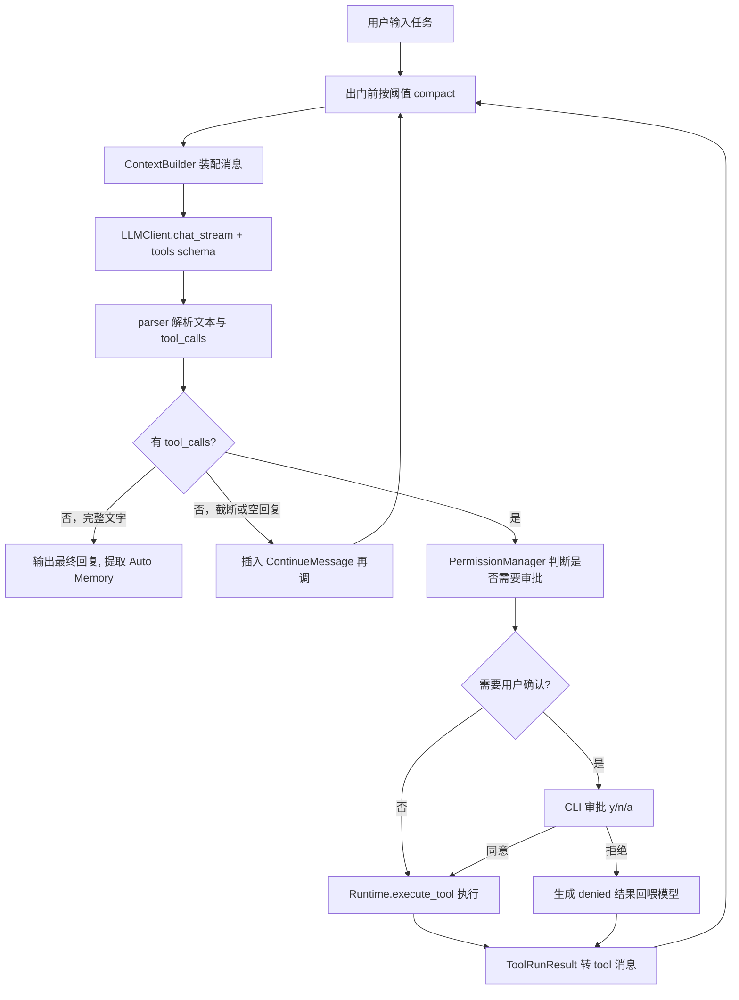

# Cyan 架构

Cyan 是一个不依赖任何 Agent 框架的 CLI 编程智能体。分层模块化（LLM / 工具 / 安全 / 上下文 / Agent Loop / CLI）。Agent Loop、工具系统、任务规划、上下文管理、Memory、模型输出解析、终止条件与错误恢复全部自行实现，仅使用 OpenAI 兼容 API 与原生 Tool Calling。

## 1. 设计原则

- 分层解耦：`CLI` 只负责交互与渲染，`core` 只负责 Agent 逻辑，二者通过**事件流**通信，换 TUI/Web 不动内核。
- 依赖倒置：`llm`、`tools`、`context`、`security` 先定义抽象接口，Loop 只依赖接口。
- 工具即插件：新增工具 = 新增一个类 + 一行注册，JSON Schema 由类自动导出。
- 错误不上抛：工具的可预期失败（文件不存在、命令超时、参数非法、权限拒绝）统一转成结构化 `ToolRunResult` 回喂模型，由模型自主恢复；只有不可恢复错误才中断循环。
- Session 是数据，Runtime 是行为：Session 保存过去和当前状态，Runtime 决定下一步行动。

## 2. 目录结构

```
src/cyan/
  __main__.py            # 入口，参数解析
  errors.py              # 异常体系
  logutil.py             # logging 配置（默认只写文件，不抢 rich 界面）
  settings/              # 按职责拆开的运行时设置（CLI 参数 > 环境变量 > 默认值）
    agent.py             # AgentSettings：一次运行的入口（workspace + 各域）
    loader.py            # load_settings()
    llm.py               # LLMSettings：模型、地址、超时与重试、流式开关
    loop.py              # LoopLimits：轮次 / 失败 / 重复上限
    tools.py             # ToolLimits：输出与读取截断
    cli.py               # CliSettings：日志、权限模式、状态目录
    compact.py           # CompactPolicy：阈值、预留、保留轮数（启动默认值）
  cli/
    app.py               # REPL 主循环、斜杠命令分发、事件流消费
    commands.py          # CommandRegistry：可扩展的斜杠命令
    renderer.py          # rich 渲染与界面文案
    completion.py        # 斜杠命令与 @path 实时补全
    file_refs.py         # 从任务文本解析 @path 并拍成 FileBlock 快照
  core/
    types.py             # AgentEvent / StopReason / AgentStream
    runtime.py           # Runtime 组装 LLM / 工具 / 权限 / 上下文
    loop.py              # AgentLoop 驱动任务循环
    tool_executor.py     # ToolExecutor：实际执行工具（预留 hook 点）
    prompts.py           # identity system prompt 与 compact / 续写提示
  prompt/                # Prompt Layer（组窗时叠进 system，不进 Session）
    types.py             # PromptLayerKind / PromptLayer
    files.py             # 发现并读取 ~/.cyan/cyan.md 与 {workspace}/.cyan/cyan.md
    skills.py            # 发现并读取个人级 / 项目级 SKILL.md
    stack.py             # PromptStack：顺序、按层截断、render_system()
  memory/                # 项目级 Auto Memory（.cyan/memory/）
    types.py             # MemoryKind / MEMORY.md 上限
    settings.py          # CYAN_DISABLE_AUTO_MEMORY
    store.py             # 合法文件名、读写索引
    extract.py           # COMPLETED 后一次提取 chat
  session/               # Session 数据层（Loop 只通过 Runtime 读写）
    types.py             # 会话字段、工具执行历史、TodoItem
    session.py           # Session 门面
    compact.py           # 对话压缩（区间 → 额外 chat → compact overlay）
    events.py            # SessionEvent
    paths.py             # ~/.cyan 与路径编码
    store.py             # jsonl + sidecar + last
    view.py              # 事件表 → 组窗视图
    branch.py            # load / continue / fork
    workspace_access.py  # 工具能触达的受控工作区视图
    todo_access.py       # 工具能触达的任务清单视图
  context/
    types.py             # ContextPolicy（装配期工具结果截断）
    builder.py           # ContextBuilder：装配 wire；第一条 system 叠 PromptStack
  llm/
    types.py             # Role / Block / Message 继承体系 / LLMResponse / StreamChunk
    base.py              # LLMClient 抽象（chat / chat_stream）
    deepseek.py          # OpenAI 兼容实现（DeepSeek，含 SSE）
    parser.py            # 模型输出解析：tool_call 参数 JSON 容错
  tools/
    types.py             # ToolCapability / ToolRunResult / ToolContext
    base.py              # Tool 抽象基类 + 参数校验
    registry.py          # 注册表：schema 导出 + 名称分发 + 执行封装
    diff.py              # write_file / edit_file 共用的 diff 生成
    process.py           # bash / grep 共用的子进程执行
    textnorm.py          # 文本规范化（edit_file 匹配用）
    builtin/             # 每个内置工具一个文件
      list_dir.py
      read_file.py
      write_file.py
      edit_file.py
      bash.py
      glob.py
      grep.py
      memory_list.py
      memory_read.py
      memory_write.py
      todo_write.py
  security/
    types.py             # PermissionMode / 审批协议 / PermissionOutcome
    permissions.py       # PermissionManager：判定链入口
    messages.py          # 回喂模型的权限文案
    paths.py             # 路径沙箱 + 写目标展示路径
    shell.py             # Plan 模式只读命令判定、执行头提取
    command_paths.py     # 从 bash 命令抽出路径，套文件规则
    allowlist.py         # 本会话「始终允许」：write:{目录} / exec:{命令}
    floor.py             # 关键路径 rm/rmdir：强制询问，allow 不能预先批准
    rule_syntax.py       # Bash(pytest *) / Read(.env) / Edit(src/**)
    policy.py            # RuleSet：deny / ask / allow 判定
    settings_file.py     # 内置 + 用户 + 项目 + local JSON
    catalog.py           # 从 defaults.json 读命令名单 / 包装前缀 / 路径分析表
    defaults.json        # 内置 deny / ask + shell 名单
    rules.py             # 执行层二次拦截：转调 floor + 内置规则
    readonly.py          # 兼容旧导入，转调 shell.py
```

每个领域包对齐同一骨架：`types.py` 放 enum / dataclass；行为按职责单独成文件；共用函数用具体名字（`paths` / `diff` / `process` / `shell`），不设 `utils.py`。`settings/` 本身就是按域拆开的 dataclass；`cli/` 没有独立数据契约。

## 3. Agent Loop 与数据流



`runtime.run(task)` 是一个 **generator**（`AgentStream`），`yield` 事件给 CLI，审批通过 `send()` 回传 `ApprovalDecision`，内核完全不依赖 `input()`。事件定义在 [`core/types.py`](../src/cyan/core/types.py)：

| 事件 | 含义 |
| --- | --- |
| `TaskStarted` | 本轮任务开始 |
| `Thinking` | 正在等待模型（CLI 可显示转圈） |
| `AssistantReplyDelta` / `ToolCallDelta` | 流式增量，只用于展示 |
| `AssistantReply` | 本轮完整可见文本（下游逻辑只认这一条） |
| `ApprovalRequired` | 需要 CLI `send(ApprovalDecision)` |
| `ToolStarted` / `ToolFinished` | 工具真正执行的起止 |
| `Notice` | 重试、压缩、拦截等提示 |
| `TaskFinished` | 结束，携带 `StopReason` 与统计 |

改事件形态会同时动 Loop、CLI 和测试里的 `drive()`。

**终止条件**：

- 模型返回无 `tool_calls` 的完整回复 → `COMPLETED`（随后提取 Auto Memory）
- 达到 `max_iterations`（默认 30）→ `MAX_ITERATIONS`
- 连续空回复或输出被截断（`finish_reason` 为 `length` / `max_tokens`）达到失败上限 → `MAX_ITERATIONS`（未达上限则插入 `ContinueMessage` 再调）
- 用户 Ctrl-C → `USER_ABORT`（离开前补齐未回复的 tool_call，保证会话配对完整）
- 连续 N 次工具失败（默认 3）→ `TOOL_FAILURES`
- 「同工具 + 同参数」连续重复且中间无成功进展（默认 3）→ `REPEATED_CALLS`
- LLM 不可恢复错误、超窗压缩失败 → `FATAL_ERROR`

token 预算触发压缩后任务继续；压缩失败不中断循环。API 报超窗则紧急压缩（`max_keep=0`）后最多再恢复两次。权限拒绝、用户拒绝不算连续失败（`counts_as_failure=False`）。

### Message 继承体系 + Block 内容模型 + ToolHistory 事实记录

三个互相独立的结构：`Block` 承载「消息里的信息」，`Message` 只是「role + 一组 blocks」的容器，`ToolHistory` 承载「Agent 执行工具的事实记录」——三者不互相继承，`ToolHistory` 也不属于 `Message`。

```
Message (ABC dataclass：role: ClassVar[Role] + blocks: list[Block])
├── SystemMessage      # 只放一个 TextBlock
├── UserMessage        # TextBlock + 用户 "@path" 引用的若干 FileBlock
├── SummaryMessage     # 压缩后的区间摘要；to_api 仍是 user
├── ContinueMessage    # 截断/空回复后续写指令；to_api 仍是 user，压缩时不当作用户任务
├── AssistantMessage   # TextBlock + 若干 ToolCallBlock
└── ToolMessage        # 只放一个 ToolResultBlock（只有 call id）

Block (ABC：type: ClassVar[BlockType])
├── TextBlock        # 文本
├── ToolCallBlock    # 一次工具调用（id / name / arguments）
├── ToolResultBlock  # 对一次工具调用结果的引用，只有 tool_call_id
├── FileBlock        # "@path" 文件引用（path / content 快照 / start_line / end_line）
└── CodeBlock        # 独立代码片段（language / code），暂无代码路径构造

session.tool_history（与 Message 完全解耦，挂在 Session 上，只负责保存与查询）
├── ToolResult      # content —— 工具输出原文
├── ToolExecution   # id / tool_name / arguments / status / result / started_at / finished_at / duration / error
└── ToolHistory     # dict[call_id, ToolExecution]，record() / get() / remove()

context.builder.ContextBuilder（装配层，由 Runtime 持有）
└── build_messages()  # 反查 ToolHistory；第一条 system 叠 PromptStack；工具正文按上限截尾
```

**`@path` 文件引用全链路**：CLI 提交任务时（`cli/app.py._execute`），
`cli/file_refs.py.extract_file_refs()` 从任务文本里解析出 `@path`，读出引用时刻的文件
内容快照，打包成 `FileBlock` 列表，随任务字符串一起传给 `Runtime.run(task, file_refs=...)`
→ `AgentLoop.run()`，构造成 `UserMessage(blocks=[TextBlock(task), *file_refs])`。
之后完全走既有的 `UserMessage` 管线：`to_api()` 把 `FileBlock` 渲染成
`[文件 path]` + 代码块拼进 wire content；`Session.add()` 把 `file_blocks` 序列化进
`USER` 事件 payload 的 `files` 字段；`session/view.py` 重放时反序列化
回 `FileBlock`；`session/compact.py` 判断超大、截断保留段都按渲染后的完整内容（文本 +
文件快照）计算。补全由 `cli/completion.py.FileReferenceCompleter`
提供，跟斜杠命令补全共用同一套 `on_text_changed` 重触发机制。

### Skills 机制

跟 cyan.md 同一套「磁盘文件 → 组窗时叠进 system」的模式，但支持多个、各自独立触发。
**自动叠层启动时默认关闭**（`PromptStack.skills_enabled` 默认 `False`）。
环境变量 `CYAN_ENABLE_SKILLS=1`（见 `prompt/skills.py.skills_layer_enabled()`）只改
启动默认值；会话中途用 `/skills on|off` 立刻改总开关，用 `/skills enable <name>`
在总开关关闭时只把这一个叠进本会话（`PromptStack.skills_active`）。发现（`/skills`）
与手动单次强调（`/skill <name>`）不受启动默认值影响。默认关闭是因为 skill 正文往往
不短、数量也可能不少，全量常驻注入对 token 开销不友好。一个 Skill 是一个目录 + 一份
`SKILL.md`，文件开头是手写的极简 frontmatter（不引入 PyYAML）：

```
---
name: debugging-methodology
description: 遇到报错、测试失败、运行结果跟预期不一致时使用
---

<正文：给模型看的详细步骤/checklist>
```

两层发现（[`prompt/skills.py`](../src/cyan/prompt/skills.py) 的 `discover_skills()`）：

- 个人级：`{home}/skills/<name>/SKILL.md`，默认 `~/.cyan/skills/`
- 项目级：`{workspace}/.cyan/skills/<name>/SKILL.md`
- 同名冲突时项目级覆盖个人级

**为什么整篇正文直接嵌进 system，而不是像 Claude Code 那样先给摘要、模型按需调用工具去读全文**：
项目级 skill 落在工作区沙箱内，`read_file` 能读到；但个人级 skill 存在工作区之外，天然越出
`security/paths.py.resolve_path` 只认工作区的沙箱。直接把「触发条件 + 正文」整段渲染成一个
`PromptLayer`（`PromptLayerKind.SKILL`）塞进 `PromptStack.refresh_files()`，复用跟 cyan.md
完全一样的按 `max_chars` 截断、不写回 Session 的逻辑，既不用给沙箱开洞，也不用为此单独起一个工具。

**开关（`/skills enable|disable <name>`）**：`SkillMeta.enabled` 由 `discover_skills()` 在扫描后
按开关文件计算得出，`load_skill_layers()` 只把 `enabled=True` 的转成层。开关状态写进跟该
skill 同一层级的 `skills.json`（个人级 `~/.cyan/skills.json`，项目级
`{workspace}/.cyan/skills.json`，形如 `{"disabled": [...]}`），两层各自独立、取并集判断
是否禁用，不像内容那样「项目级覆盖个人级」——这样项目可以强制关掉某个个人偏好 skill。
`/skill <name>` 不受这个开关限制：即使被 disable，手动指定依然生效一次。

### Session 与 Runtime

```
Runtime（执行层，不保存长期状态）
 ├── LLMClient
 ├── ContextBuilder / ContextPolicy   # 装配 wire；叠 PromptStack
 ├── PromptStack                      # identity + cyan.md + Skills + MEMORY.md
 ├── CompactPolicy                    # 何时压、留几轮
 ├── LoopLimits / ToolLimits          # 本会话策略副本
 ├── ToolRegistry
 ├── ToolExecutor
 ├── PermissionManager
 └── Session（数据层）

Session
 ├── metadata      # id / created_at / updated_at / title / parent_id
 ├── messages        # list[Message] —— 组窗视图，不是完整事件表
 ├── tool_history    # ToolHistory
 ├── state           # current_task / consecutive_tool_failures / last_call_fingerprint / consecutive_identical_calls
 ├── workspace       # root / cwd / opened_files / modified_files
 ├── permissions     # permission_mode / always_allowed（write:{目录} / exec:{命令名}）
 ├── usage           # input_tokens / output_tokens / total_tokens / llm_calls / tool_calls
 ├── events          # 完整事件表（与磁盘 jsonl 对应）
 └── todos           # list[TodoItem]，todo_write 整体覆盖式维护，随 checkpoint / meta.json 持久化
```

**运行时策略与斜杠命令**

配置分三类，不一律 `replace`：

- **启动身份**（workspace、api_key、log）：留在 `AgentSettings` / App，进程内基本不改。
- **会话状态**（`permission_mode`、`always_allowed`）：挂在 Session；`/mode` 改这个。
- **本会话行为策略**（compact / loop / tools / context）：默认值只住 `settings/`，`Runtime.create()` 用 `dataclasses.replace()` 各拷一份注入 Runtime。会话中途用斜杠命令改副本，不写回 `AgentSettings`。

`/compact show|set`、`/loop`、`/tools limits|<字段> <值>`、`/context` 分别查看/修改对应副本；`cli/commands.py` 里的 `_show_policy` / `_set_policy_field` 按 dataclass 字段的类型注解做字符串转换。

模型参数（`model` / `stream` / `temperature`）留在 `LLMSettings`。`DeepSeekClient.model` 是只读 property（实时读 `self._llm.model`），`/model` 与 `/stream` 改完下一次调用立刻生效，不需要重建客户端。

关键约束：**`Message` 子类自己不额外开业务字段，也不直接持有工具执行的真实内容**。`ToolMessage` 只知道「这条消息对应哪个 call id」。一次工具调用真正的输出内容、成功与否、执行耗时存在 `tool_history` 里。发给模型时由 `ContextBuilder` 按 `max_tool_result_chars` 截尾，不写回 Session。

对话压缩会把较早的消息区间额外 `chat` 一次收成 `SummaryMessage` 写回**组窗视图**，并删除该区间对应的内存 `tool_history` 条目；**不删除** jsonl 里的原文。失败则两者都不改。

`Runtime.messages_for_request()` 委托给 `ContextBuilder.build_messages()`——叠 PromptStack 到第一条 system 的 **wire** 上（cyan.md 不写回 Session）；`LLMClient.chat()` 直接接收装配好的 `list[dict]`，不需要认识内部 `Message`。

## 4. 工具系统

统一契约（`tools/base.py`）：

```python
class Tool(ABC):
    name: str
    description: str
    capability: ToolCapability  # READ / WRITE / EXEC —— 决定模式怎么分流
    parameters: dict            # JSON Schema，直接喂给 tool calling
    def describe(self, args, workspace, workspace_access=None) -> tuple[str, str | None, str]: ...
    def run(self, ctx: ToolContext, **kwargs) -> ToolRunResult: ...
```

`ToolRunResult(ok, content, error, metadata)`：`content` 是给模型看的纯文本，`metadata` 给 CLI 渲染用（如 diff）。工具拿不到整个 Session，只拿 `ToolContext`（`WorkspaceAccess` + `TodoAccess` + 限额）。

内置工具：

- `list_dir`：目录树，支持 depth，自动跳过 `.git` / `node_modules` / `.venv`
- `read_file`：带行号返回，支持 offset/limit，大文件截断并提示；整篇读完才记入 `opened_files`（`write_file` / `edit_file` 用 `has_read` 做前置检查）
- `write_file`：整文件写入/新建
- `edit_file`：精确字符串替换（`old_string` 必须唯一，否则报错让模型补上下文）
- `glob`：按文件名模式找文件（Python 实现，支持 `**` 与一层花括号），按 mtime 新→旧最多 100 条；不尊重 `.gitignore`，跳过 `.git/`
- `grep`：子进程调用 `rg`；`files_with_matches`（默认）/ `content` / `count`；遵守 `.gitignore`，显式 `path` 可搜被 ignore 的文件
- `memory_list` / `memory_read` / `memory_write`：项目级笔记；`CYAN_DISABLE_AUTO_MEMORY=1` 时不注册 `memory_write`
- `todo_write`：覆盖式更新任务清单；不改文件系统
- `bash`：唯一的 shell 执行入口：
  - 接口只有 `command`（必填）与 `timeout_ms`（默认 120000，上限 `max_bash_timeout_ms`）
  - 每条命令都在独立新进程里跑，没有持久 shell；不保留环境变量或别名
  - 工作目录会在调用之间延续：命令后追加 trailer 打印 `$PWD`，写回 `Session.bash_cwd`；越出工作目录会被拉回根
  - stdout/stderr 合并，超过 `max_tool_output_chars`（默认 30000）时截尾并加 `...[truncated]`
  - system prompt 写明本机 `sys.executable` 的绝对路径

文件类工具的路径一律相对项目根，不跟 bash 的 `cd` 走。

## 5. 安全模型

`ToolCapability` + 声明式规则，由 [`PermissionManager.evaluate()`](../src/cyan/security/permissions.py) 一次判定。

**能力**：`READ` / `WRITE` / `EXEC`。Plan 拒写（`todo_write` 例外，规划本身就是 Plan 该干的事）；AcceptEdits 放行普通写（执行仍要确认）。

**判定顺序**：工作区沙箱 → deny 规则 → 关键删除强制询问 → ask 规则 → 只读 bash / allow 规则 → 三种模式与会话白名单。deny 压过 allow。关键删除的落点不走「区外拒绝」，以便用户能当场确认。Plan 在 allow 之前：`Edit(src/**)` 不能覆盖 Plan 拒写。`deny Read(.env)` 连带挡住同一路径的写入与 bash 读。

**关键删除**（[`floor.py`](../src/cyan/security/floor.py)）：`rm` / `rmdir` 打到 `/`、`/usr` 等根下顶级目录、家目录、`.`、工作区或其父目录；`$VAR/*` / `$VAR/`；命令替换里的同样形状。`permissions.allow` 不能预先批准，用户可以当场确认。

**规则**（[`defaults.json`](../src/cyan/security/defaults.json) + 用户/项目/local JSON）。只读命令、包装前缀、安全环境变量、acceptEdits 文件系统命令写在同一文件的 `shell` 段，用户设置不能覆盖。

| 种类 | 处置 | 内置例子 |
|------|------|----------|
| **deny** | 永远 DENY | `Bash(sudo *)`、`Bash(git push --force *)` |
| **ask** | NEED_APPROVAL + `force=True`，没有「始终允许」 | `.env`、私钥、`pip install`、`git push`、写 `.git` / `.vscode` / `.cyan` / shell rc |
| **allow** | 放行（deny 与关键删除仍优先） | `Bash(pytest *)`、`Edit(src/**)` |

写法：`Bash(pytest *)` / `Read(.env)` / `Edit(src/**)` / `WebFetch(domain:host)`。`Tool(param:value)` 匹配顶级标量参数（deny/ask）；主要内容字段（`command` / `path` / `url`）不能这么写。`Write` 裸名匹配写入工具；`Write(路径)` 收下但不做路径检查，请用 `Edit`。未知工具名按工具名匹配。路径还可写成 `/src/**`（相对设置源）、`~/Documents/*.pdf`、`//tmp/scratch.txt`。复合命令先切段（`&&` `||` `;` `|` `|&` `&` 换行）：deny/ask 任一段命中即生效；allow 必须每段都命中。点 `a` 对复合命令按子命令各存一条 allow，最多 5 条。

设置文件：内置 defaults + `~/.cyan/settings.json` + `{workspace}/.cyan/settings.json` + `settings.local.json`。`/permissions` 列出、增（写 local）、删（local / 项目 / 用户，不能删内置）。

**PermissionMode**（规则没覆盖时）：

| 模式 | 只读 | 普通写入 | 普通执行 |
|------|------|----------|----------|
| Plan | 放行 | DENY | 仅放行只读命令（名单在 `defaults.json` 的 `shell`） |
| Default | 放行 | 需审批 | 只读命令免审批，其余需审批 |
| AcceptEdits | 放行 | 直接放行（内置 ask 仍要确认） | 工作区内 `mkdir`/`touch`/`mv`/`cp`/`rm`/`sed` 免审批，其余需审批 |

Plan 模式下模型只看到只读工具 + `bash`（bash 写操作仍被权限层拦）。裸 `deny: write` 会把写入类工具从 schema 里摘掉（`hidden_tool_names()`），含 `todo_write`。

审批选项：`y` 本次允许 / `n` 拒绝 / `a` 本会话始终允许同类操作（仅非 force）。写入按目录前缀（根目录文件记 `write:.`；`write:pkg` 放行 `pkg/` 及其子目录）。执行按**每一段**的命令头（`exec:pytest` 只放行 `pytest …`）。bash 点 `a` 还会往 local 按子命令追加 `Bash(pytest *)`，最多 5 条。路径沙箱独立于规则：文件工具走 `resolve_path`；bash 由 `command_paths.py` 抽出能看清的路径再套同一套沙箱。`python -c`、命令替换等解析不到的标成不透明，路径层不当成已看清，但 `allow` 仍可放行。路径只按 Linux 语义处理。

组件职责：

1. **`floor.py`**：关键路径删除（强制询问）
2. **`rule_syntax.py` / `policy.py` / `settings_file.py`**：规则解析、合并、判定
3. **`shell.py` / `catalog.py`**：只读判定与执行头提取
4. **`command_paths.py`**：从 bash 命令抽出路径
5. **`allowlist.py`**：本会话始终允许的范围键
6. **`PermissionManager`**：编排判定链，产出 `PermissionOutcome`
7. **工具 `run()`**：对内置 write deny / 区外路径再拦一次

## 6. 上下文管理、会话与 Memory

- **Token 记账**：压缩触发看「即将发出的整包」——组窗后的 wire 用 JSON 字符数 / 4 粗估；上一轮 API 的 `usage.prompt_tokens`（`last_prompt_tokens`）只作补充。默认窗口按 deepseek-chat 常见 64k 计。优先保留 `keep_recent_turns` 轮；不够切或仍超窗时降到 1 轮乃至全部压进摘要。
- **压缩 overlay**：成功后往事件表追加 `summary` + `compact`，再投影成视图；**不删除** jsonl 里的原文。组窗只看 Session.messages + 视图内的 tool_history。REPL `/compact` 走同一入口。不做滑动窗口。
- **会话持久化**（`CYAN_HOME` 可覆盖根目录，默认 `~/.cyan`）：
  - `projects/<路径编码>/<id>.jsonl`：只追加的事件日志
  - `projects/<路径编码>/<id>/meta.json`：sidecar（cwd、白名单、todos、usage）
  - `projects/<路径编码>/last`：`--continue` 指向的会话
  - `history`：REPL 输入历史
- **恢复与分叉**：`--continue` / `--resume` / REPL 内 `/resume` 恢复成功后用 `Renderer.render_transcript()` 回放真实对话（跳过 identity `SystemMessage`、`ContinueMessage`、`ToolMessage`；`SummaryMessage` 单独标出）。`/rewind restore` 是 fork：拷贝锚点及之前的源事件到新 jsonl，**不回滚工作区文件**；权限模式在 REPL 内切换会话时沿用当前会话，不恢复磁盘上的旧模式。
- **Prompt Layer**：identity（`build_system_prompt`）写入 `session_started`；用户级 `~/.cyan/cyan.md` 与项目级 `{workspace}/.cyan/cyan.md`（没有则回退根目录 `cyan.md`）是独立层。`MEMORY.md` 索引作为 `AUTO_MEMORY` 层叠进 wire。cyan.md / Skills / memory **不进 jsonl**。
- **Skills**：见第 3 节。自动叠层启动默认关闭；`CYAN_ENABLE_SKILLS=1` 改启动默认值。
- **Auto Memory**：只做项目级，目录 `{workspace}/.cyan/memory/`（gitignore）。任务中 `memory_write` 即时写（非 Plan 免审批）；仅 `COMPLETED` 后再提取一次。`USER_ABORT` / `FATAL_ERROR` / 轮次上限 / 连续失败不沉淀。`CYAN_DISABLE_AUTO_MEMORY=1` 关闭。
- **任务规划（`todo_write`）**：模型自己判断何时用（3 步以上/多文件），每次传入完整清单，同一时刻最多一项 `in_progress`。数据在 `Session.todos`，随 checkpoint 与 `meta.json` 走。工具侧只拿 `TodoAccess`。权限上特判为始终 allow（不受 Plan 限制）；裸 `deny: write` 仍会把它从模型可见工具列表里摘掉。

## 7. 现状（对照课程要求）

课程要求自行实现的闭环均已落地，不再按阶段增量填充：

| 要求 | 对应实现 |
| --- | --- |
| Agent Loop | `core/loop.py`：generator + 事件流，全部终止条件与错误恢复 |
| 工具系统 | `tools/`：统一契约、注册表、11 个内置工具 |
| 任务规划 | `todo_write` + `Session.todos` + `/todos` |
| 上下文管理 | compact overlay、token 预算、超窗紧急压缩 |
| Memory | 项目级 `.cyan/memory/`（即时写入 + COMPLETED 提取） |
| 模型输出解析 | `llm/parser.py`（tool_call JSON 容错）+ 流式拼接 |
| 终止条件 / 错误恢复 | 见第 3 节；工具失败回喂模型，不中断循环 |
| 文件权限与命令安全 | `security/`：沙箱、硬地板、声明式规则、三种模式 |
| 工程化 | 按模块拆分的 pytest、ruff + vulture、GitHub Actions |

交互侧已具备：SSE 流式与 tool_call 参数预览、rich 审批 diff、斜杠命令与 `@path` 补全、会话 `--continue` / `--resume` / rewind fork、cyan.md / Skills / Auto Memory。

## 8. 依赖

运行时：`openai`（厂商 API 客户端）、`prompt-toolkit`（REPL 输入与补全）、`python-dotenv`、`rich`。开发：`pytest`、`ruff`、`vulture`。无需引入任何 Agent 框架。
